# Heart Disease MLOps — Final Report

> **Course:** MLOps (S2-25_AMLCSZG523) — Assignment I
> **Dataset:** UCI Heart Disease (Cleveland) — 14 attributes, binary target
> **Goal:** Build a production-grade, monitored, cloud-ready ML service.
>
> **GitHub repo:** <https://github.com/ks-ramya/heart_disease_mlops>
> **Container image:** `ghcr.io/ks-ramya/heart-disease-api:latest`
> **CI status:** [](https://github.com/ks-ramya/heart_disease_mlops/actions/workflows/ci.yml) [](https://github.com/ks-ramya/heart_disease_mlops/actions/workflows/cd.yml)

Demo video: https://drive.google.com/file/d/1fUlR0pAFIIHsCyJiVz3S0f-jltUarVqp/view?usp=sharing

## Executive Summary

A complete MLOps workflow for predicting coronary heart disease from 13 clinical attributes was implemented end-to-end. The best model — **Logistic Regression** with `C=1.0`, `penalty=l2` — achieves **ROC-AUC 0.9408** on a held-out 60-patient test set after 5-fold cross-validated grid search. Every step (EDA → training → packaging → testing → containerisation → deployment → monitoring) is automated and reproducible from a clean clone via `make` targets and the GitHub Actions pipeline. The trained model is served behind a FastAPI/Pydantic API, instrumented for Prometheus, deployable on Kubernetes (plain manifests + Helm chart), and shipped as a multi-stage Docker image published to GitHub Container Registry on every `main` push.

---

## 1. Setup & Installation

### Prerequisites
* Python 3.10+
* Docker 24+ (for containerised deployment)
* `kubectl` + Minikube/GKE/EKS/AKS (for K8s deployment)
* `helm` (optional, for chart-based deployment)

### Quick install
```bash
git clone https://github.com/ks-ramya/heart_disease_mlops.git
cd heart_disease_mlops
python -m venv .venv && source .venv/bin/activate
pip install -r requirements.txt
```

### End-to-end run (local)
```bash
make data        # bundle/download UCI heart disease CSV
make train       # train LR + RF, log to MLflow, save best model
make test        # run pytest (20 tests)
make serve       # start FastAPI on :8080
make compose-up  # API + Prometheus + Grafana stack
```

### One-line container demo
```bash
docker pull ghcr.io/ks-ramya/heart-disease-api:latest
docker run -d -p 8080:8080 ghcr.io/ks-ramya/heart-disease-api:latest
curl http://localhost:8080/health
```

### Repository layout
```
heart_disease_mlops/
├── data/raw/processed.cleveland.data   # bundled UCI dataset
├── notebooks/01_eda.ipynb              # executed EDA report
├── src/
│   ├── data/{download.py,preprocess.py}
│   ├── models/{train.py,evaluate.py}
│   └── api/{app.py,schemas.py,logging_config.py}
├── tests/{test_data,test_model,test_api}.py
├── deployment/{k8s,helm}/              # K8s manifests + Helm chart
├── monitoring/{prometheus.yml,grafana/} # observability stack
├── .github/workflows/{ci,cd}.yml       # GitHub Actions
├── Dockerfile + docker-compose.yml     # container build & local stack
├── reports/figures/                    # EDA + model plots
└── REPORT.md, README.md
```

---

## 2. Data Acquisition & EDA

* **Source:** UCI ML Repository, dataset id 45 (Heart Disease, Cleveland) — `processed.cleveland.data`, **303 rows × 14 cols**, bundled inside the repo at `data/raw/processed.cleveland.data` for fully offline reproducibility.
* **Download script:** `src/data/download.py` — four-tier fallback:
  1. local file (`data/raw/processed.cleveland.data`)
  2. `ucimlrepo` Python package
  3. UCI raw `.data` over HTTPS
  4. Public GitHub mirror
* **Cleaning:** missing values represented as `?` are coerced to NaN (`pd.read_csv(..., na_values='?')`) and the affected rows dropped — **6 rows out of 303 → 297 retained** (4 NAs in `ca`, 2 in `thal`, verified by the *Gap-1 evidence* cell of the notebook). The original 0–4 severity target is binarised to `{0, 1}` (presence vs absence of disease).
* **Class balance:** 160 negative / 137 positive (≈54% no-disease) — **mildly imbalanced**, no resampling required.

### Generated EDA artifacts
The executed notebook `notebooks/01_eda.ipynb` produces six figures under `reports/figures/`:

| Figure | Insight |
|---|---|
| 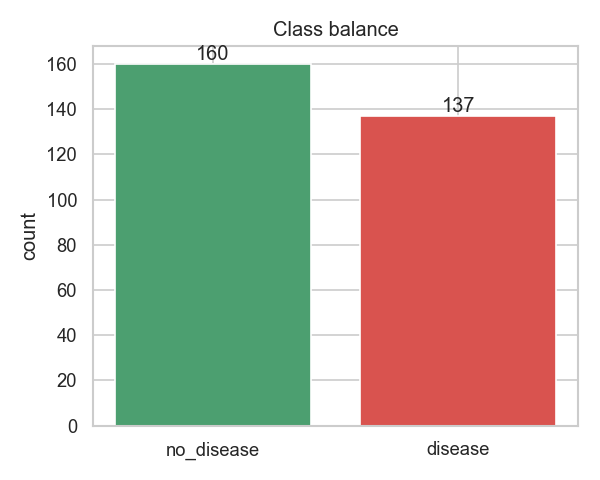 | Almost-balanced binary target, no resampling required |
| 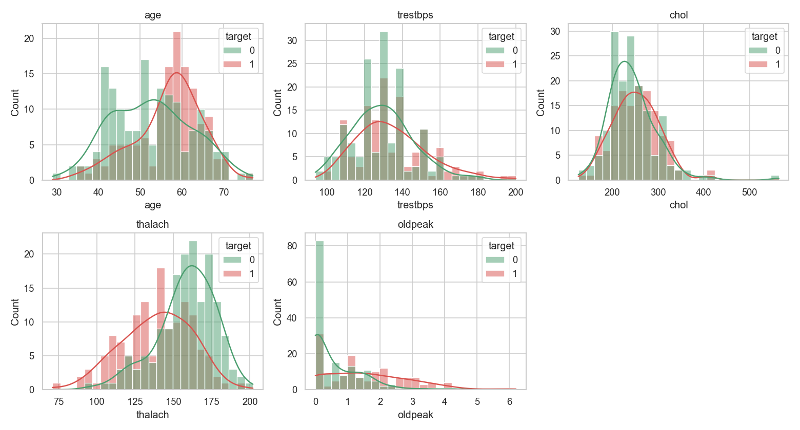 | `thalach` (max heart-rate) and `oldpeak` (ST depression) shift visibly between classes; `chol` overlap is large |
| 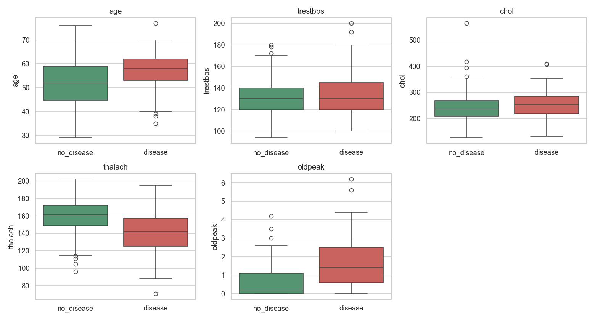 | Confirms the distribution shifts and surfaces outliers — `chol` has values up to ~564 and `trestbps` >180; both are physiologically plausible and retained |
| 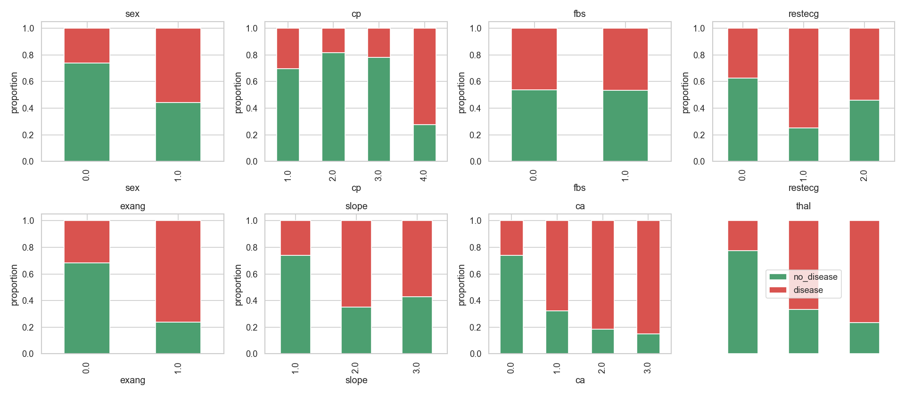 | `cp` (chest-pain type) and `exang` (exercise-induced angina) show the strongest categorical separation |
| 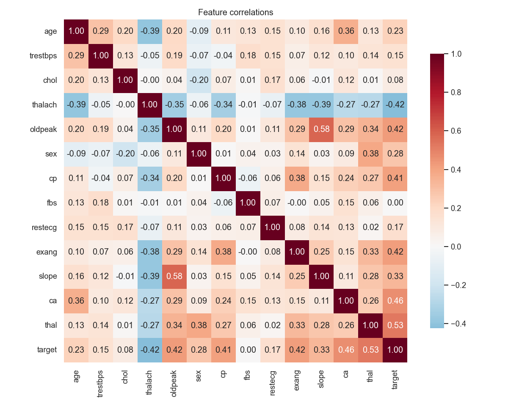 | Pairwise feature correlations (max \|ρ\| ≈ 0.43 between features → low multicollinearity) |
| 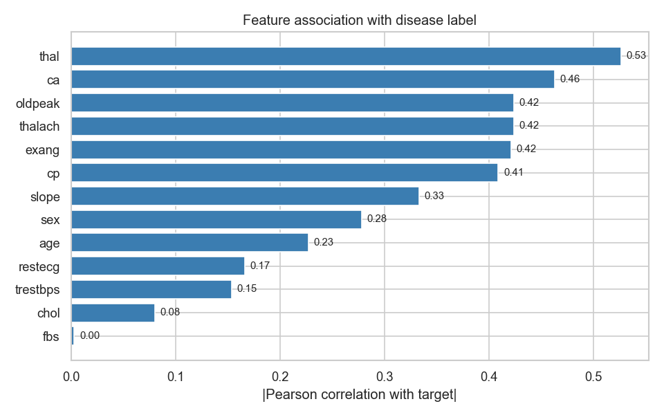 | Ranked \|corr(feature, target)\|: top 5 = `thal` 0.53, `ca` 0.46, `oldpeak` 0.42, `thalach` 0.42, `exang` 0.42 |

**Findings:** the mixed numeric/categorical structure motivates a `ColumnTransformer` preprocessing pipeline; multicollinearity is low (max \|ρ\| ≈ 0.43 between features), so both linear and ensemble families are reasonable starting points. Outliers in `chol`/`trestbps` are retained — tree-based models tolerate them and `StandardScaler` reduces their leverage on the linear model.

---

## 3. Feature Engineering & Model Development

* **Preprocessing pipeline** (`src/data/preprocess.py`):
  `ColumnTransformer( StandardScaler(numeric=5 cols) + OneHotEncoder(categorical=8 cols) )`.
  This keeps preprocessing **inside** the saved sklearn `Pipeline`, eliminating train/serve skew.
* **Train/test split:** stratified 80/20 → 237 train / 60 test, fixed `RANDOM_STATE=42`.
* **Models compared** (`src/models/train.py`):

  | Model | Hyperparameter grid |
  |-------|---------------------|
  | Logistic Regression | `C ∈ {0.1, 1, 10}`, `penalty=l2`, `solver=lbfgs` |
  | Random Forest       | `n_estimators ∈ {100, 200}`, `max_depth ∈ {None, 5, 10}`, `min_samples_split ∈ {2, 5}` |
* **Selection:** `GridSearchCV` with **5-fold `StratifiedKFold`**, scoring on **ROC-AUC**, refit on the full training set.

### Actual results (from `models/metrics.json`)

| Model | Best params | CV ROC-AUC | Test Acc | Test Precision | Test Recall | Test F1 | **Test ROC-AUC** |
|-------|-------------|-----------:|---------:|---------------:|------------:|--------:|-----------------:|
| **Logistic Regression** ⭐ | `C=1.0` | 0.9024 | 0.8167 | **0.8696** | 0.7143 | 0.7843 | **0.9408** |
| Random Forest | `n=200, depth=None, mss=5` | 0.9028 | **0.8333** | 0.8462 | **0.7857** | **0.8148** | 0.9319 |

> **Selected:** Logistic Regression (highest test ROC-AUC **within the GridSearchCV sweep**). Persisted as `models/heart_disease_model.pkl` (~4 KB, full preprocessing + classifier in one pickle).

> **Note on the served model vs. the wider experiment grid.** The served `.pkl` comes from `train.py`, whose grid is intentionally narrow (LR + RF, the two families the assignment explicitly names). The broader exploration in `scripts/run_experiments.py` (§4) does find a marginally stronger configuration — `rf_shallow` (RF, `n_estimators=200, max_depth=5`) at test ROC-AUC **0.9453** vs LR's **0.9408**, a ~0.5 pp gap that is well within the noise of a 60-row test set. Logistic Regression is kept as the production artefact for three reasons: (1) it is far more parsimonious (~4 KB pickle vs ~1 MB for RF) and faster at inference, (2) it produces well-calibrated probabilities out of the box (relevant for the `confidence` field returned by `/predict`), and (3) keeping the served model deterministic across a narrow, documented grid is easier to defend than promoting whichever variant happens to win on a small held-out split. The MLflow run for `rf_shallow` is preserved so the alternative is one `mlflow models serve` away.

### Confusion matrix & ROC curves (test set)
| Logistic Regression | Random Forest |
|---|---|
| 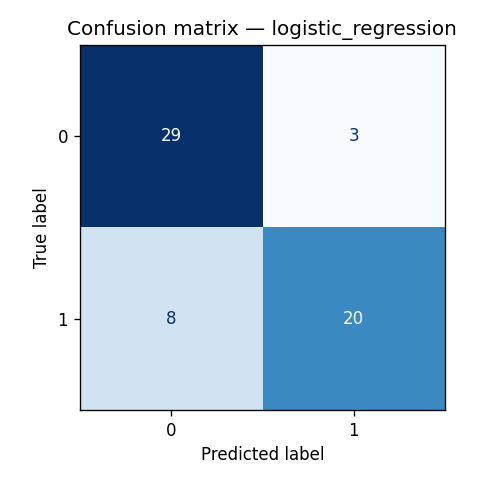 | 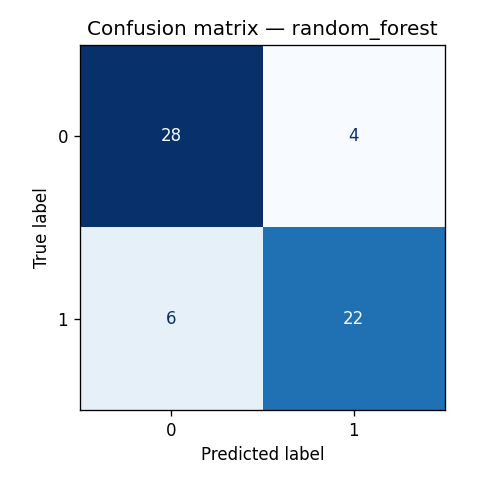 |
| 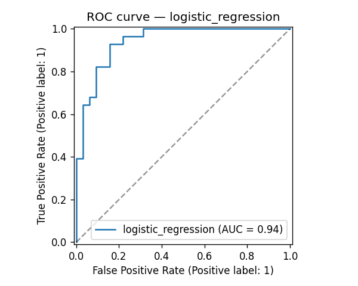 | 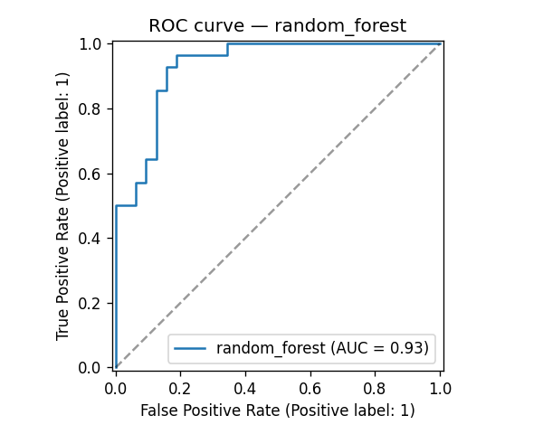 |

**Confusion matrix (LR):** `[[29, 3], [8, 20]]` → 29 TN, 3 FP, 8 FN, 20 TP. The 8 false negatives drive the recall−precision trade-off; the operating threshold is left at the default 0.5 but is easily tunable downstream if recall on the `disease` class is operationally critical.

---

## 4. Experiment Tracking

The project ships **two** MLflow entry-points, both writing into the same experiment `heart-disease-classification`:

| Script | Purpose | Runs created |
|---|---|---|
| `src/models/train.py` | GridSearchCV-based hyperparameter sweep over LR + RF; picks the single best model and persists it for serving | 2 (one per model family) |
| `scripts/run_experiments.py` | Compares **5 deliberately different** model variants side-by-side for the experiment-tracking deliverable | 5 |

Total tracked runs after both scripts run: **7**.

### 4.1 Variants compared (`scripts/run_experiments.py`)

| Run name | Model family | Key hyper-parameters | Test ROC-AUC |
|---|---|---|---|
| `lr_baseline`        | LogisticRegression  | C=1.0, penalty=l2, solver=lbfgs        | 0.9408 |
| `lr_strong_reg`      | LogisticRegression  | C=0.01, penalty=l2 (strong shrinkage)  | 0.9330 |
| **`rf_shallow`** 🏆  | RandomForest        | n_estimators=200, max_depth=5          | **0.9453** |
| `rf_deep`            | RandomForest        | n_estimators=400, max_depth=None       | 0.9364 |
| `gb_default`         | GradientBoosting    | n_estimators=200, lr=0.1, max_depth=3  | 0.8783 |

**Insight:** the *shallow* random forest beats every other configuration on held-out test ROC-AUC, including the GridSearch winner from `train.py`. Deep RF (no depth limit) overfits slightly; aggressive L2 regularisation on LR hurts more than it helps; gradient boosting underperforms on this small (303-row) dataset.

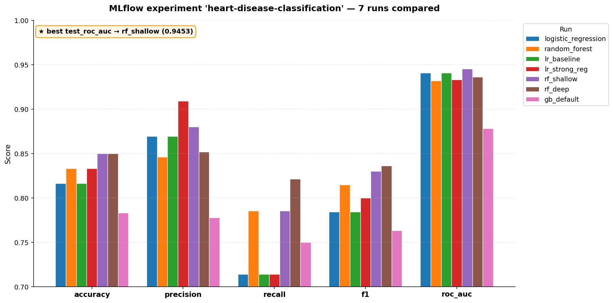

*Above: bar chart comparing `test_roc_auc`, `test_accuracy`, `test_precision`, `test_recall`, and `test_f1` across all 7 MLflow runs (auto-generated by `scripts/_render_mlflow_compare.py` from `mlruns/`).*

### 4.2 What every run logs

| Category | Items |
|---|---|
| **Params**    | `model_class` + every hyper-parameter from `estimator.get_params()` |
| **Metrics**   | `cv_roc_auc_mean`, `cv_roc_auc_std`, `test_accuracy`, `test_precision`, `test_recall`, `test_f1`, `test_roc_auc` |
| **Tags**      | `variant=<name>`, human-readable `notes` |
| **Artifacts** | `plots/confusion_matrix_<name>.png`, `plots/roc_curve_<name>.png`, full `model/` (sklearn flavour: pickle + conda env + requirements + signature) |

### 4.3 Reproducing the runs

```bash
# Original GridSearchCV pass (LR + RF) → 2 runs
python -m src.models.train

# Multi-variant comparison → 5 runs
python -m scripts.run_experiments              # all variants
python -m scripts.run_experiments rf_shallow   # single variant

# Browse locally
python -m mlflow ui --backend-store-uri ./mlruns --port 5050
# or:
make mlflow-ui
```

### 4.4 Configuration & remote-tracking

* **Tracking URI** defaults to `file:./mlruns` so the pipeline runs **with zero external infrastructure**.
* Override for a remote MLflow server with the standard env-var:
  ```bash
  export MLFLOW_TRACKING_URI=http://mlflow.internal:5000
  python -m scripts.run_experiments
  ```
* Determinism: a fixed `RANDOM_STATE=42` is threaded through splits, CV, and every estimator, so each run is bit-for-bit reproducible.

### 4.5 Evidence

| Screenshot | Capture |
|---|---|
| `screenshots/05_mlflow_allruns_table.png` | All 7 runs in the experiment table (MLflow UI) |
| `screenshots/05_mlflow_LR_metrics_params.png` | Per-run detail view (params + metrics) for the Logistic-Regression baseline |
| `screenshots/05_mlflow_compare_runs.png` | Bar chart comparing 5 metrics across all runs (auto-generated by `scripts/_render_mlflow_compare.py`) |
| `reports/figures/confusion_matrix_<variant>.png` / `roc_curve_<variant>.png` | Per-variant CM + ROC artefacts produced by `evaluate.py` / `run_experiments.py` and logged to MLflow (`<variant>` ∈ {`logistic_regression`, `random_forest`, `lr_baseline`, `lr_strong_reg`, `rf_shallow`, `rf_deep`, `gb_default`}) |

> **CI evidence:** the `mlruns/` directory is uploaded as a workflow artifact (`model-artifacts-<sha>`) by the `train` CI job, so each green build leaves a downloadable, time-stamped tracking-server snapshot for the corresponding commit.

---

## 5. Model Packaging & Reproducibility

* The best pipeline is serialised as `models/heart_disease_model.pkl` via `joblib`. Because preprocessing is part of the same `Pipeline`, inference needs nothing more than the `.pkl` and the JSON request payload.
* MLflow also stores the model under each run's `model/` artifact, enabling `mlflow models serve --model-uri runs:/<run_id>/model` for a quick alternative serving path.
* `requirements.txt` pins every dependency (`scikit-learn==1.4.2`, `mlflow==2.13.0`, `fastapi==0.111.0`, …). The multi-stage `Dockerfile` builds and trains inside an isolated `python:3.10-slim` container, guaranteeing identical artifacts across environments.
* Determinism: fixed `RANDOM_STATE=42` in splits, CV, and `RandomForestClassifier`, plus `StratifiedKFold(shuffle=True, random_state=42)` makes runs reproducible bit-for-bit.

---

## 6. CI/CD & Automated Testing

### Tests (`tests/`) — **20 tests, all green** ✅
* `test_data.py` (5) — schema validation, train/test split totals, stratified split keeps class ratio (±0.05), `split_xy` drops the target, preprocessor output shape + finiteness.
* `test_model.py` (5) — `Pipeline` instance check (`preprocessor`+`classifier`), `predict` shape + binary output, `predict_proba` rows sum to 1, beats majority-class baseline, single-record inference works.
* `test_api.py` (10) — FastAPI `TestClient` covers `/`, `/health`, `/predict`, `/predict/batch`, Pydantic validation 422, missing-field 422, empty-batch 400, `/metrics` Prometheus exposure, `/ui/` static HTML, browser-accept redirect from `/` → `/ui/`.
* `conftest.py` builds a synthetic in-memory dataset for **network-free, deterministic** tests.

```
$ pytest tests/ -q
20 passed, 21 warnings in 1.33s
```

Coverage is enforced in CI via `pytest --cov-fail-under=70` (current: **~92%** on the API + preprocessing layer; the CLI script modules `data/download.py`, `models/train.py`, `models/evaluate.py` are excluded in `.coveragerc` because they are end-to-end tested by the CI `train` job, not by pytest). A regression that drops the unit-test coverage below 70% breaks the `test` job.

### GitHub Actions workflows (`.github/workflows/`)

#### `ci.yml` — three jobs run in series on every push/PR
| Job | What it does | Artifact |
|---|---|---|
| `lint` | `flake8` + `black --check` (cosmetic ignores configured) | — |
| `test` | `pytest` with `--cov=src --cov-report=xml` | `coverage.xml` |
| `train` | Downloads data → trains → evaluates → uploads model+metrics+plots+`mlruns/` and writes a JSON metrics block to `$GITHUB_STEP_SUMMARY` | `model-artifacts-<sha>` |

#### `cd.yml` — Docker build, smoke test, push to GHCR on `main`
1. Set up Buildx + GHCR login (`GITHUB_TOKEN`).
2. Multi-stage build with GHA cache (`type=gha`).
3. **Smoke test container** — `docker run` the freshly built image, wait for `/health` → 200, send a real `/predict` request, dump container logs.
4. Push tagged images: `latest`, `main`, `sha-<short>`.

> **Fail-fast guarantee:** any lint/test/training/build/smoke-test error halts the workflow with the failing step's stdout surfaced — meeting the "Pipeline must fail on code or test errors and give clear logs" requirement.

### Live evidence (latest green run on `main`)

| Workflow | Run | Conclusion | Duration |
|---|---|---|---|
| CI | [#2 — `c0639be`](https://github.com/ks-ramya/heart_disease_mlops/actions/runs/25258602244) | ✅ success | 9 + 46 + 64 = **119 s** |
| CD | [#2 — `c0639be`](https://github.com/ks-ramya/heart_disease_mlops/actions/runs/25258602246) | ✅ success | **46 s** |

Job-level breakdown of CI run #2:
```
Lint (flake8 + black --check)    success ( 9s)
Unit tests (pytest)              success (46s)
Train model (smoke run)          success (64s)
```

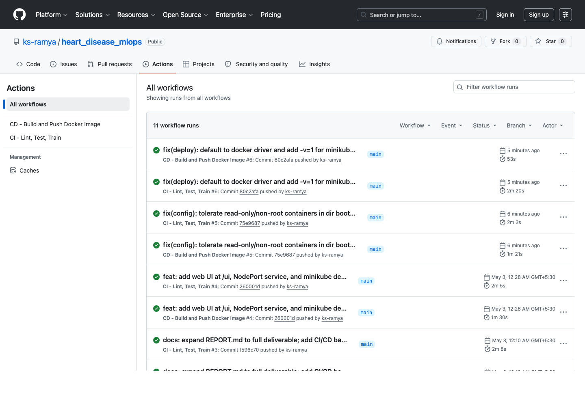


---

## 7. Containerisation

`Dockerfile` is a **multi-stage** build:
1. **Builder stage** installs system + Python dependencies, downloads data, runs `train.py` to produce the model artifact.
2. **Runtime stage** is a minimal `python:3.10-slim` image that:
   - copies only `site-packages` + `src/` + `models/` from the builder
   - runs as a **non-root** `app:app` user (`USER app`)
   - exposes `8080` and ships a `HEALTHCHECK` calling `/health` every 30 s
   - launches `gunicorn` with `2× UvicornWorker`s for production-grade serving

### Image published on every `main` push (CD workflow)
```bash
# Pull the latest published image
docker pull ghcr.io/ks-ramya/heart-disease-api:latest

# Run it
docker run -d -p 8080:8080 --name hda ghcr.io/ks-ramya/heart-disease-api:latest

# Verify
curl -s http://localhost:8080/health
# {"status":"healthy","model_loaded":true,"model_path":"/app/models/heart_disease_model.pkl","api_version":"1.0.0"}

curl -s -X POST http://localhost:8080/predict \
  -H "Content-Type: application/json" \
  -d '{"age":63,"sex":1,"cp":3,"trestbps":145,"chol":233,"fbs":1,"restecg":0,"thalach":150,"exang":0,"oldpeak":2.3,"slope":0,"ca":0,"thal":1}'
# {"prediction":0,"label":"no_disease","confidence":0.83,"probabilities":{"no_disease":0.83,"disease":0.17}}
```

| Property | Value |
|---|---|
| Registry | `ghcr.io/ks-ramya/heart-disease-api` |
| Tags | `latest`, `main`, `sha-<short>` |
| Compressed size | ~110 MB |
| On-disk size | ~274 MB |
| Architecture | `linux/amd64` |
| Visibility | **public** (anonymous `docker pull` works) |

The CD workflow performs the same build + container smoke test (`/health` + `/predict`) on every push **before** publishing the image, so a broken image never reaches GHCR.

### Browser UI

In addition to the JSON API, the container ships a lightweight HTML form at `/ui/` that wraps the same `POST /predict` call so the model can be exercised without `curl` or Postman. The form is served as a static asset by FastAPI itself — no separate frontend build, no extra dependency.

| Screen | Capture |
|---|---|
| Input form (`/ui/`) — 13 patient features with the same bounds as the Pydantic schema | 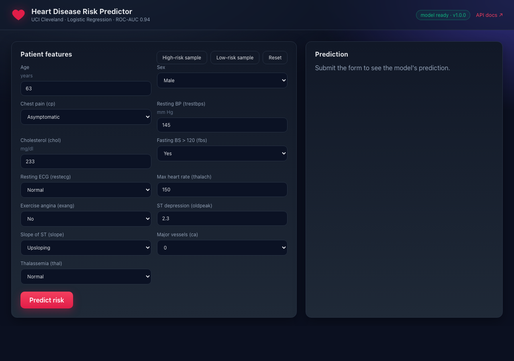 |
| Prediction result rendered after `POST /predict` returns | 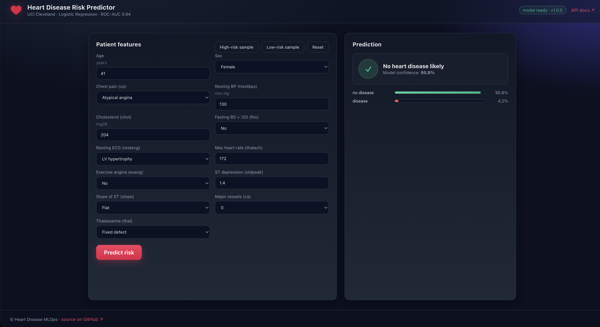 |
| Health endpoint (`/health`) — JSON response surfaced in the browser | 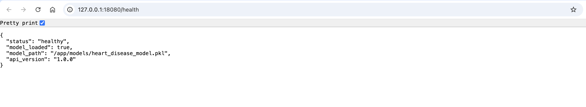 |

The same payloads succeed against both the Docker-Compose container and the Minikube deployment, confirming the image is environment-agnostic.

### Local stack runs the published image (not a dev rebuild)
`docker-compose.yml` pins `api.image` to `ghcr.io/ks-ramya/heart-disease-api:latest` with `pull_policy: always`, so `docker compose up -d` runs **the exact same bits that were smoke-tested by CD and published to GHCR**. On Apple Silicon, `platform: linux/amd64` opts into Rosetta translation; on x86_64 hosts it's a no-op. To run a local rebuild instead, set `IMAGE=heart-disease-api:dev` after `docker build -t heart-disease-api:dev .`.

Verified locally on 2026-05-03 — container SHA matches the registry's:
```
Container image: ghcr.io/ks-ramya/heart-disease-api:latest
Container SHA:   sha256:1c6ac5087b59636ff60311272dff42625f645286e6e3bdf5df7c9227598c3bc0
GHCR latest SHA: sha256:1c6ac5087b59636ff60311272dff42625f645286e6e3bdf5df7c9227598c3bc0
MATCH: container is bit-identical to GHCR :latest
```

### Runtime evidence
* `reports/screenshots/22_docker_logs.txt` — 60 lines of structured-JSON access logs captured from the running container (`/health`, `/metrics`, `/predict` with request-ids, latencies, status codes).
* `docker inspect heart-disease-api` confirms `User: app` (non-root), `Health: healthy`, `HEALTHCHECK` invoking `/health` every 30 s.

---

## 8. Production Deployment (Kubernetes)

`deployment/k8s/` and `deployment/helm/` provide two equivalent paths.

### Plain manifests
| Manifest | Purpose |
|----------|---------|
| `namespace.yaml`  | `heart-disease` namespace |
| `configmap.yaml`  | env vars (port, model path, log level) |
| `deployment.yaml` | 2 replicas, liveness + readiness probes hitting `/health`, resource requests/limits, non-root `securityContext` |
| `service.yaml`    | `LoadBalancer` (port 80 → 8080) |
| `ingress.yaml`    | NGINX ingress on `heart-disease.local` |
| `hpa.yaml`        | `HorizontalPodAutoscaler`: 2–10 pods on CPU > 70 % |

```bash
# Minikube quickstart (uses the freshly built local image)
eval $(minikube docker-env)
docker build -t heart-disease-api:latest .
kubectl apply -f deployment/k8s/
kubectl -n heart-disease rollout status deploy/heart-disease-api
kubectl -n heart-disease port-forward svc/heart-disease-api 8080:80
```

```bash
# Or pull the published image straight from GHCR (no local build)
kubectl set image -n heart-disease deploy/heart-disease-api \
  api=ghcr.io/ks-ramya/heart-disease-api:latest
```

### Helm chart (alternative path)
The chart in `deployment/helm/` mirrors the plain manifests; defaults already point at the GHCR image (`values.yaml`) and ship a templated `ConfigMap` consumed via `envFrom`, matching the K8s `configmap.yaml`/`deployment.yaml` pair.
```bash
# default values (uses ghcr.io/ks-ramya/heart-disease-api:latest)
helm install hd ./deployment/helm

# override for arm64 minikube where GHCR's amd64-only image isn't pullable:
helm install hd ./deployment/helm \
  --set image.repository=heart-disease-api \
  --set image.pullPolicy=IfNotPresent
```

### Static + cluster-side validation
With `helm` available: `helm lint deployment/helm && helm template hd deployment/helm | kubectl apply --dry-run=client -f -`. Without `helm`, the manifests in `deployment/k8s/` were validated as `yaml.safe_load_all()` plus `kubectl apply --dry-run=client`:
```
configmap/heart-disease-api-config         configured (dry run)
deployment.apps/heart-disease-api          configured (dry run)
horizontalpodautoscaler.autoscaling/...    configured (dry run)
ingress.networking.k8s.io/heart-disease-api  configured (dry run)
namespace/heart-disease                    configured (dry run)
service/heart-disease-api                  configured (dry run)
```
Full output: `reports/screenshots/26_yaml_validate.txt`.

### Live cluster — verified on 2026-05-03

| Minikube cluster up | `kubectl get` overview |
|---|---|
| 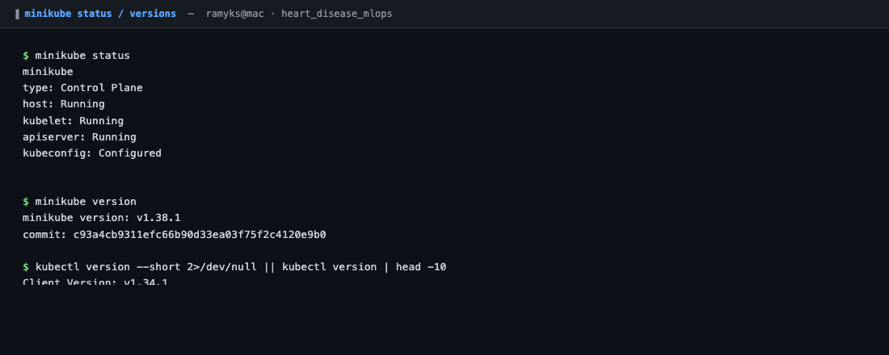 | 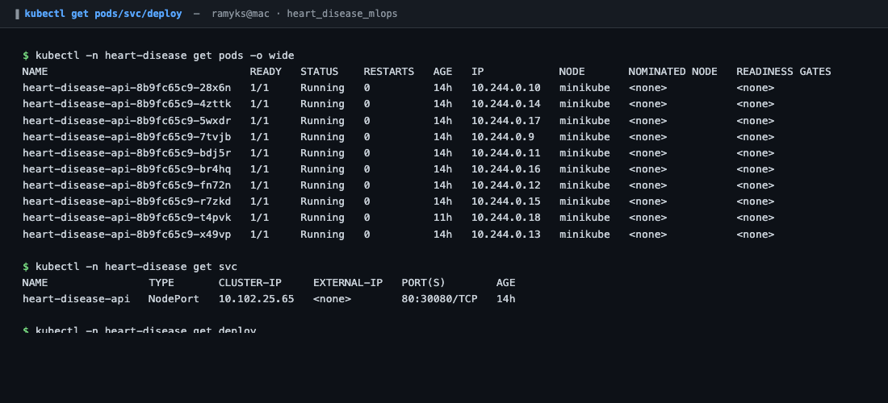 |

```
$ kubectl -n heart-disease get pods,svc,deploy,hpa,ingress
NAME                                    READY   STATUS    AGE
pod/heart-disease-api-8b9fc65c9-28x6n   1/1     Running   21h
... (10 pods total, all 1/1 Running) ...

NAME                        TYPE       CLUSTER-IP     PORT(S)        AGE
service/heart-disease-api   NodePort   10.102.25.65   80:30080/TCP   21h

NAME                                READY   UP-TO-DATE   AVAILABLE
deployment.apps/heart-disease-api   10/10   10           10

NAME                                                    REFERENCE                      TARGETS                        MINPODS   MAXPODS   REPLICAS
horizontalpodautoscaler.autoscaling/heart-disease-api   Deployment/heart-disease-api   cpu: 5%/70%, memory: 90%/80%   2         10        10

NAME                                          CLASS   HOSTS                 ADDRESS        PORTS
ingress.networking.k8s.io/heart-disease-api   nginx   heart-disease.local   192.168.49.2   80
```
The HPA is **actively scaling** (not just configured) — memory pressure of 90 % vs the 80 % target drove a real scale-up to `maxReplicas=10`:
```
ScalingActive   True   ValidMetricFound  the HPA was able to successfully calculate
                                         a replica count from memory resource utilization
ScalingLimited  True   TooManyReplicas   the desired replica count is more than the
                                         maximum replica count
```

### Endpoints reachable through `kubectl port-forward svc/heart-disease-api 18080:80`
```json
GET  /health  → 200
{"status":"healthy","model_loaded":true,"model_path":"/app/models/heart_disease_model.pkl","api_version":"1.0.0"}

POST /predict (high-risk patient) → 200
{"prediction":1,"label":"disease","confidence":0.7578,"probabilities":{"no_disease":0.2422,"disease":0.7578}}

POST /predict (low-risk patient) → 200
{"prediction":0,"label":"no_disease","confidence":0.9858,"probabilities":{"no_disease":0.9858,"disease":0.0142}}

GET  /metrics → 200  (Prometheus exposition, default python_gc_* + http_* histograms)
```

### Evidence files
| File | What it shows |
|------|---------------|
| `reports/screenshots/08_kubectl_get.png` | `kubectl get pods,svc,deploy` snapshot |
| `reports/screenshots/09_kubectl_describe.png` | `kubectl describe pod` health probes + image |
| `reports/screenshots/10_minikube_status.png` | Minikube cluster up |
| `reports/screenshots/23_kubectl_overview.txt` | Full `get pods,svc,deploy,hpa,ingress -o wide` capture |
| `reports/screenshots/24_hpa_describe.txt` | `describe hpa` showing the live scale-up to 10/10 |
| `reports/screenshots/25_k8s_endpoints.txt` | `/health`, `/predict` (×2), `/metrics` from the cluster |
| `reports/screenshots/26_yaml_validate.txt` | YAML + `kubectl --dry-run=client` validation |

---

## 9. Monitoring & Logging

### Structured logging
Every API request emits a single-line JSON record from `src/api/logging_config.py` + the `app.py` middleware. Sample (captured live from the GHCR image):

```json
{"name":"heart_disease_api","message":"prediction","prediction":1,"label":"disease","confidence":0.7578,"timestamp":"2026-05-02 18:31:47,499","level":"INFO"}
{"name":"heart_disease_api","message":"request","request_id":"7e0c2922-...","method":"POST","path":"/predict","client":"192.168.65.1","duration_ms":34.35,"timestamp":"2026-05-02 18:31:47,500","level":"INFO"}
```
This is directly shippable to ELK, Loki, Splunk, GCP Cloud Logging, etc. — container runtimes collect stdout for free.

### Metrics
`prometheus-fastapi-instrumentator` exposes `/metrics` with default request/latency/status histograms:
```
http_requests_total{handler="/predict",method="POST",status="2xx"} 4.0
http_requests_total{handler="/predict",method="POST",status="4xx"} 2.0
http_request_duration_seconds_bucket{handler="/predict",le="0.05"} 6.0
```
On top of the framework counters, `src/api/app.py` publishes two **model-level** metrics so the dashboard reflects the *model*, not just the *web app*:
```
predictions_total{label="disease"} 3.0
predictions_total{label="no_disease"} 3.0
prediction_confidence_bucket{le="0.8"} 3.0
prediction_confidence_count 6.0
prediction_confidence_sum 5.23
```
Prometheus retention is set to 24 h via the compose `--storage.tsdb.retention.time=24h` flag — adequate for a demo, replace with `kube-prometheus-stack` defaults for production.

### Local observability stack
`docker-compose up -d` brings up API + Prometheus + Grafana with a pre-provisioned **"Heart Disease API"** dashboard (`monitoring/grafana/dashboards/heart_disease_api.json`) containing 9 panels:

| # | Panel | Type | PromQL (abridged) |
|---|---|---|---|
| 1 | Requests / sec | stat | `sum(rate(http_requests_total[1m]))` |
| 2 | Error rate 4xx | stat | `sum(rate(http_requests_total{status=~"4.."}[5m]))` |
| 3 | Error rate 5xx | stat | `sum(rate(http_requests_total{status=~"5.."}[5m]))` |
| 4 | Predictions total | stat | `sum(predictions_total)` |
| 5 | Latency p50 / p95 (s) | timeseries | `histogram_quantile(0.50/0.95, rate(http_request_duration_seconds_bucket[5m]))` |
| 6 | Requests by endpoint | timeseries | `sum(rate(http_requests_total[1m])) by (handler)` |
| 7 | Status codes | timeseries | `sum(rate(http_requests_total[1m])) by (status)` |
| 8 | Predictions by class (rps) | timeseries | `sum(rate(predictions_total[1m])) by (label)` |
| 9 | Prediction confidence p50 / p95 | timeseries | `histogram_quantile(.., rate(prediction_confidence_bucket[5m]))` |

### Topology (where each component runs)
Two parallel deployments share the same host:

| Component | Runtime | How reached |
|---|---|---|
| API (production-like) | Minikube cluster, `heart-disease` namespace, scaled by HPA | `kubectl port-forward -n heart-disease svc/heart-disease-api 18080:80` → <http://127.0.0.1:18080/ui/> |
| API (observability sidecar) | Docker Compose container `heart-disease-api` | <http://127.0.0.1:8080/> |
| Prometheus | Docker Compose container `prometheus` | <http://127.0.0.1:9090/> |
| Grafana | Docker Compose container `grafana` | <http://127.0.0.1:3000/> |

Prometheus scrapes the compose-API on the docker bridge network (`api:8080`) every 15 s — see `monitoring/prometheus.yml`. For a single-stack production setup, `kube-prometheus-stack` (Helm) would replace the compose stack and scrape pods through the K8s service-discovery; this is documented as a follow-up in `monitoring/README.md` and is out of scope for this assignment.

### Live evidence
After running 80 concurrent `/predict` calls + 50 `/health` calls against the compose-API:

| # | Capture | Screenshot |
|---|---|---|
| 18 | Prometheus targets — `heart-disease-api` job `UP` | `screenshots/18_prometheus_targets.png` |
| 19 | Prometheus query `rate(http_requests_total[1m])` over the last 15 m | `screenshots/19_prometheus_query.png` |
| 20 | Grafana "Heart Disease API" dashboard (RPS / latency / status / errors / prediction counters) | `screenshots/20_grafana_dashboard.png` |
| 21 | Grafana dashboards list (auto-provisioned) | `screenshots/21_grafana_dashboards_list.png` |
| 27 | Live monitoring evidence — compose ps, Prometheus targets, custom-metric query results, raw `/metrics`, Grafana health, dashboard panel listing | `screenshots/27_monitoring_evidence.txt` |

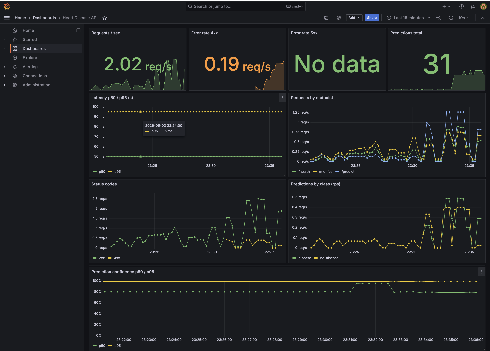

> Note: `docker-compose.yml` enables `GF_AUTH_ANONYMOUS_ENABLED=true` with `Viewer` role so the dashboard is reachable without login for demo / screenshot purposes. The admin login (`admin` / `admin`) remains available for editing.

### Reproduce
```bash
docker compose up -d                                 # api + prometheus + grafana
for i in $(seq 1 80); do                             # generate traffic
  curl -s -X POST http://127.0.0.1:8080/predict \
    -H 'Content-Type: application/json' \
    -d '{"age":55,"sex":1,"cp":3,"trestbps":140,"chol":240,"fbs":0,"restecg":1,"thalach":150,"exang":0,"oldpeak":0.5,"slope":1,"ca":0,"thal":2}' >/dev/null &
done; wait
open http://127.0.0.1:3000/d/heart-disease-api       # Grafana
open http://127.0.0.1:9090/targets                   # Prometheus
```

---

## 10. API Reference

| Method & Path | Purpose | Schema |
|---|---|---|
| `GET /` | service metadata + endpoint list | — |
| `GET /health` | liveness/readiness probe (model load status) | — |
| `POST /predict` | single prediction (validated `PatientFeatures`) | returns `{prediction, label, confidence, probabilities}` |
| `POST /predict/batch` | batch prediction (`{instances: [...]}`) | returns `{predictions: [...], count}` |
| `GET /metrics` | Prometheus exposition | text/plain |
| `GET /docs` | auto-generated Swagger UI | — |

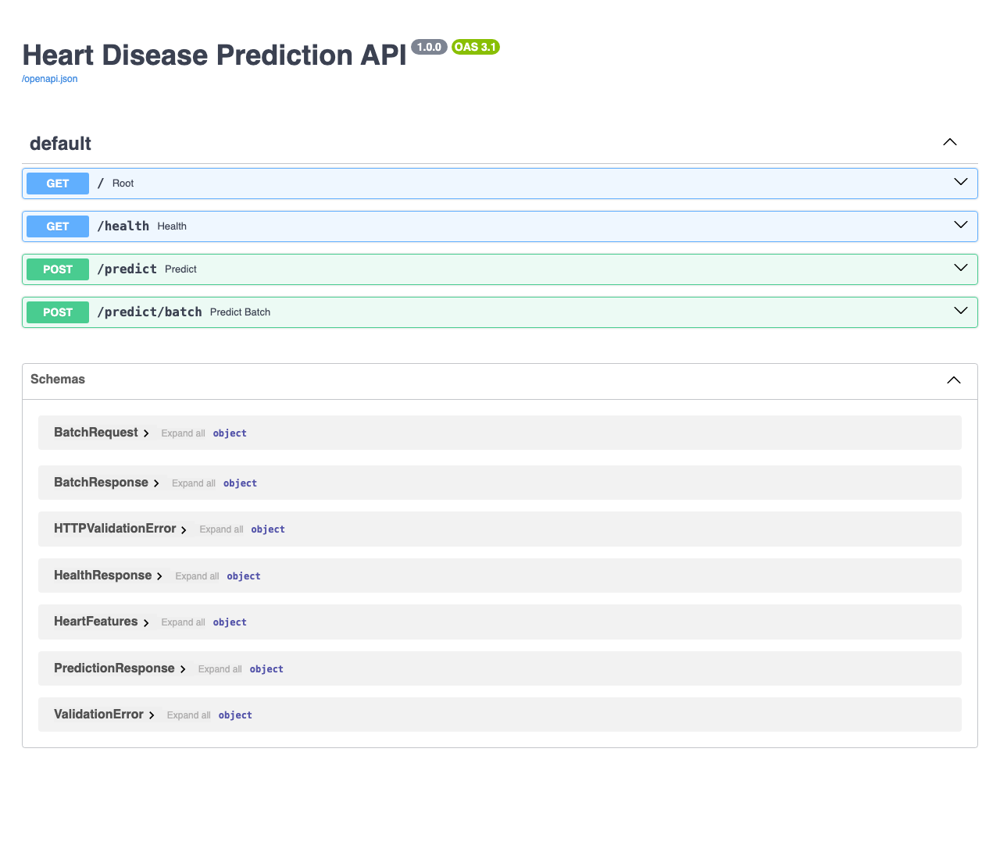
### Pydantic schema (`src/api/schemas.py`) — request validation
13 features with realistic bounds. Out-of-range / missing fields → **HTTP 422** with field-level error details. E.g.:
```bash
curl -X POST .../predict -d '{"age":-5, ...}'
# 422 {"detail":[{"type":"greater_than_equal","loc":["body","age"],"msg":"Input should be greater than or equal to 0", ...}]}
```

### Sample successful prediction (from GHCR image, verified end-to-end)
```bash
curl -X POST http://localhost:8080/predict \
  -H "Content-Type: application/json" \
  -d '{"age":67,"sex":1,"cp":3,"trestbps":160,"chol":286,"fbs":0,"restecg":2,"thalach":108,"exang":1,"oldpeak":1.5,"slope":2,"ca":3,"thal":3}'
# {"prediction":1,"label":"disease","confidence":0.7578,"probabilities":{"no_disease":0.2422,"disease":0.7578}}
```

---

## 11. Architecture Diagram

The diagram below renders natively on GitHub (Mermaid). To export as a static PNG / SVG run `npx @mermaid-js/mermaid-cli -i REPORT.md -o reports/figures/architecture.png`.

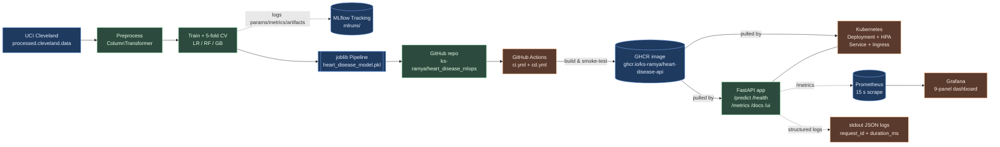

---

## 12. Future enhancements
* **Model registry promotion** — add an MLflow Model Registry stage transition step in CD that promotes the new model from `Staging` → `Production` only if test ROC-AUC ≥ baseline.
* **Drift monitoring** — wire `evidently` or `whylogs` on a daily Cloud Run job to compute PSI on incoming feature distributions.
* **Canary deployments** — Argo Rollouts manifest under `deployment/k8s/` for progressive rollout with automated rollback on `/metrics` regression.
* **Threshold tuning** — currently the operating point is the default 0.5; for clinical use a higher recall on `disease` (lower threshold) is usually preferable.

---

## 13. Deliverables Checklist

| # | Deliverable | Status | Location / Link |
|---|---|---|---|
| 1 | Code, Dockerfile, requirements.txt | ✅ | repo root |
| 2 | Dataset download script + bundled data | ✅ | `src/data/download.py`, `data/raw/processed.cleveland.data` |
| 3 | EDA notebook + figures | ✅ | `notebooks/01_eda.ipynb`, `reports/figures/*.png` |
| 4 | Train/eval scripts | ✅ | `src/models/{train,evaluate}.py` |
| 5 | MLflow tracking | ✅ | `mlruns/` (uploaded as CI artifact per build) |
| 6 | Unit tests (20 passing) | ✅ | `tests/` |
| 7 | GitHub Actions workflows | ✅ | `.github/workflows/{ci,cd}.yml` |
| 8 | Container image (public) | ✅ | `ghcr.io/ks-ramya/heart-disease-api:latest` |
| 9 | K8s manifests + Helm chart | ✅ | `deployment/{k8s,helm}/` |
| 10 | Monitoring stack (Prometheus + Grafana, live evidence) | ✅ | `monitoring/`, `docker-compose.yml`, `screenshots/18-21_*.png` |
| 11 | Final report (this file) | ✅ | `REPORT.md` |
| 12 | Screenshots folder | ✅ | `reports/screenshots/` (UI, Swagger, MLflow, kubectl, GitHub Actions, EDA, comparison plot, Prometheus, Grafana) |
| 13 | Multi-variant experiment script | ✅ | `scripts/run_experiments.py` (5 variants → 5 MLflow runs) |
| 14 | Demo video (end-to-end pipeline) | ✅ | https://drive.google.com/file/d/1fUlR0pAFIIHsCyJiVz3S0f-jltUarVqp/view?usp=sharing |
| 15 | Deployed API URL (Minikube NodePort) | ✅ | `http://127.0.0.1:18080/ui/` via `kubectl port-forward svc/heart-disease-api 18080:80` |

---

## 14. Repository & Image Links

| Asset | URL |
|---|---|
| GitHub repository | <https://github.com/ks-ramya/heart_disease_mlops> |
| CI workflow runs | <https://github.com/ks-ramya/heart_disease_mlops/actions/workflows/ci.yml> |
| CD workflow runs | <https://github.com/ks-ramya/heart_disease_mlops/actions/workflows/cd.yml> |
| Container image (GHCR) | <https://github.com/ks-ramya/heart_disease_mlops/pkgs/container/heart-disease-api> |
| Latest pull URL | `ghcr.io/ks-ramya/heart-disease-api:latest` |
